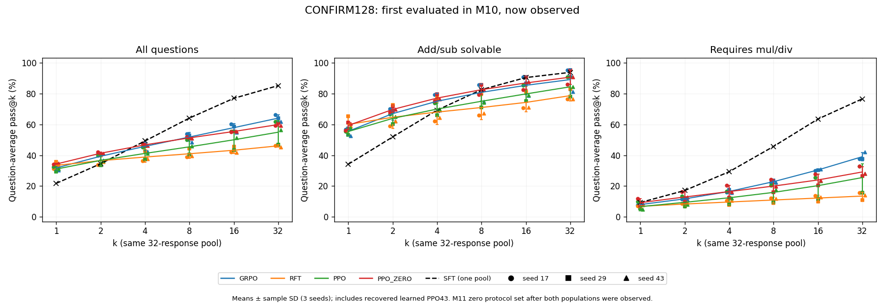

# PetitZero

A single-RTX 4090 study of online LLM post-training on exact-verifier arithmetic, comparing GRPO, online verified-positive RFT and learned-value PPO, followed by a separate fixed-zero-value PPO intervention.

PetitZero project code is licensed under Apache-2.0. This repository contains code, compact saved results and documentation; model weights/adapters and private training artifacts are not included.

## Research questions

- How do single-sample success and finite multi-sample question coverage change after online post-training?
- What changes when PPO's learned values are replaced by fixed zeros within the recorded recipe?
- Can a portable learned-PPO implementation preserve request and checkpoint state across an actual process exit/resume?

The third question is engineering validation and does not contribute scientific result rows.

## Setup and methods

Qwen2.5-1.5B-Instruct, one shared verified LoRA SFT initializer (M1A), and a strict exact-Fraction arithmetic verifier define the common setup. All formal continuations branch independently from that same initializer. The formal comparison uses seeds 17/29/43, fixed slot 256 endpoints, and matched request/update budgets; compute is not equal across methods.

| Method | Training signal |
| --- | --- |
| GRPO | Within-question group-relative advantages and a clipped policy objective |
| Online verified-positive RFT | Supervised learning on its own verified-positive responses; **not policy-gradient RL** |
| Learned-value PPO | PPO with an independent learned critic and GAE |
| Fixed-zero PPO, separate M11 intervention | The PPO recipe with old values fixed to zero and no critic/head |

See the [technical report](docs/technical_report.md) for fixed recipes, denominators, measured resources and all seed results.

## Main result: success and finite coverage can move differently

Historical FINAL256 and CONFIRM128 are separate populations. **CONFIRM is now observed**; it is a same-range residual slice, not an unseen or distribution-shift test.

On CONFIRM128, online post-training increased single-sample success while finite 32-sample question coverage decreased at these endpoints:

| Policy/recipe | Sampled pass@1 (%) | Finite pass@32 (%) |
| --- | ---: | ---: |
| Shared SFT, one pool | 21.7773 | 85.1563 |
| GRPO, three-seed mean | 31.7790 | 64.0625 |
| Online RFT, three-seed mean | 33.4310 | 46.0938 |
| Learned PPO, three-seed mean | 31.0384 | 54.9479 |

These are rounded presentations of existing [method summaries](results/method_summaries.csv). Full precision, sample SD and separate historical FINAL results remain in the [report](docs/technical_report.md) and [seed points](results/seed_points.csv). Finite coverage does not measure true policy support, prove that RL only sharpens, establish statistical significance or rank methods universally.

## Separate M11 value intervention

Paired **zero minus learned** differences on CONFIRM:

| Metric | Mean difference (pp) | Sample SD (pp) |
| --- | ---: | ---: |
| pass@1 | +3.263 | 1.684 |
| pass@32 | +4.948 | 8.354 |

Seed 17's pass@32 difference was **−2.344 pp**. Fixed-zero PPO did not uniformly improve coverage or restore the SFT level. Both evaluation populations were observed before the detailed M11 protocol. Across-seed endpoint SD is not gradient variance. This intervention does not show that critics are useless or that fixed-zero PPO universally wins. See [paired results](results/primary_zero_minus_learned.csv).



The figure's `CONFIRM128_RESERVED` identifier is historical; it is not an unseen-population claim. Curves show mean ± sample SD and individual seed points; SFT has one pool without training-seed SD. [Historical FINAL256 figure](results/figures/HISTORICAL_FINAL256_OBSERVED.png) remains separate. No pooled 384-question headline is used.

## CPU quickstart

Use the [recorded environment](environment.json) and [requirements](requirements-recorded.txt). Python 3.10.12 was used; the tests use installed torch 2.8.0+cu126 strictly on CPU under guards. No fresh dependency installation or CPU-only wheel compatibility claim is implied. Run from the repository root without a private PYTHONPATH:

```bash
python tests/guarded.py tests
python pz.py verify --numbers 2 3 4 --target 14 --expression '2*(3+4)'
python pz.py fixture
python pz.py analyze --counts data/endpoint_counts.csv --output offline_results
python pz.py --help
python pz.py plan --operation train --method ppo --base assets/base --sft assets/m1a --data data/synthetic_prompts.jsonl --config configs/new_execution.json --output planned_run
```

The 38 guarded tests cover scientific helper math and operational contracts with synthetic tensors/dictionaries. `analyze` reproduces saved statistics from 4,992 policy-question count rows; it generates no model answers. `plan` prints an intention and performs no execution. Its legacy one-rollout smoke proposal is separate from the completed M12C two-rollout execution. Exact prompts, demonstrations and weights are not included. See the [data boundary](data/SCHEMA.md) and [reproducibility guide](docs/reproduce.md).

## Portable execution status

The portable learned-PPO path was validated on an RTX 4090 with a bounded two-process engineering smoke: the run generated 64 training responses, saved after the first rollout, exited, restored model/optimizer/RNG/request state in a fresh process, and completed the second rollout without replaying requests. Actor and critic each completed 4 updates; both processes exited 0, with no retries or DEV/FINAL/CONFIRM evaluation.

**GRPO, online RFT, fixed-zero PPO, standalone actor evaluation, other devices/shapes, full historical replay, and uninterrupted-trajectory equivalence have not been validated through the portable GPU path.**

M12C's accepted status is `M12C_PORTABLE_LEARNED_PPO_SMOKE_RESUME_PASSED_OTHER_GPU_PATHS_UNTESTED`. This final packaging pass performed zero model/GPU work. Two display strings in CLI help/planning were updated afterward; scientific helpers and every execution-runtime file retain M12C bytes. The changed help/planning source was CPU-checked, not GPU-retested. Runtime source hashes deliberately make a newly packaged run a new identity; do not use this copy to bypass an older run's source binding.

## Repository map

| Location | Contents |
| --- | --- |
| [pz.py](pz.py), [execution runtime](petitzero/execution/runner.py) | Explicit train/evaluate/smoke/resume and offline interfaces |
| [verifier](petitzero/countdown.py), [math walkthrough](docs/code_walkthrough.md) | Exact arithmetic and synthetic objective/mask examples |
| [configs](configs/main_recipes.json), [synthetic fixture](data/synthetic_prompts.jsonl) | Recorded recipes and prompt-only engineering input |
| [results](results/statistics.json), [provenance](provenance.json) | Frozen count-derived results and source bindings |
| [numerical consistency](docs/numerical_consistency.md) | Precision, alignment and save/restore evidence boundaries |
| [limitations](docs/limitations.md), [reproduction](docs/reproduce.md) | Scientific scope, operational coverage and external assets |

## Limitations and PPO43 recovery

**Learned PPO43 continued through a documented post-failure recovered slot 192 state. The original committed identity was absent; historical memory-to-disk roundtrip and uninterrupted execution equivalence were not proven.** PPO43 remains in the primary analysis; learned/paired summaries, including pair43, inherit this limitation. M12C does not repair it. The existing matched 17/29 secondary analysis applies to both branches and does not replace the primary results.

Findings are conditional on one SFT initializer, a small arithmetic task and three endpoint trajectories. They are not broad mathematical-reasoning claims. Reward failures and duplicate answers remain in denominators. Finite pass@k, sampled-prefix KL/entropy and endpoint SD have distinct meanings; see [limitations](docs/limitations.md).

## Assistance, references and rights

Implementation, debugging, experiment execution assistance, analysis and documentation used a coding agent under the owner's instructions. This is not a claim of unaided implementation or an official partnership. See [authors/disclosure](AUTHORS.md).

[References](docs/references/SOURCES.md) and the [upstream Qwen notice](notices/Qwen-LICENSE) are retained. PetitZero project code is released under [Apache-2.0](LICENSE), subject to applicable upstream component/model licenses and notices. The first public release excludes model weights/adapters, exact private prompt sets, private SFT demonstrations and private engineering evidence. See [license status](docs/license_status.md).
